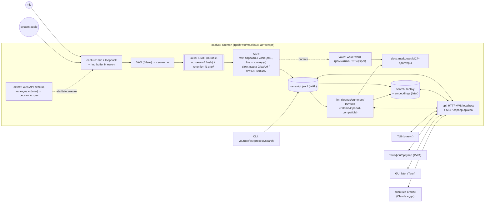

# Целевая архитектура localvox (черновик, 2026-07-10)

> Как из текущей «звезды» (`service-architecture.md`) вырасти в модульного
> голосового секретаря, не сломав durable-ядро. Фичи — `feature-backlog.md`,
> модели — `local-models.md`.

## Три слоя

```
┌─ ИНТЕРФЕЙСЫ (клиенты, заменяемые) ──────────────────────────────┐
│ TUI · трей-меню · PWA (телефон/браузер) · GUI (Tauri, later)    │
│ CLI-команды · внешние агенты через MCP-сервер                   │
├─ МОДУЛИ (всё новое — отключаемое) ──────────────────────────────┤
│ llm (F1) · voice (F2) · slots (F2/F5) · search (F4)             │
│ api+mcp (F6) · detect (F3) · ingest (есть)                      │
├─ ЯДРО (незыблемое, уже работает) ───────────────────────────────┤
│ audio capture (cpal/wasapi) · VAD/сегментация · durable queue   │
│ ASR-пул · transcript.jsonl (WAL) · session recovery · события   │
└─────────────────────────────────────────────────────────────────┘
```

Правило: ядро не знает о модулях; модули подписываются на события ядра и читают его
артефакты (файлы). Клиенты не знают о модулях напрямую — только через API/события.
Отчуждаемость (решение 2026-07-11): любая работа с транскриптом (поиск, чат,
обработки, версии) взаимодействует **только с файлами сессии** — каждый такой модуль
выносим в отдельный процесс/инструмент без вскрытия ядра.

## Целевая топология процессов



Переходный период: TUI продолжает жить в одном процессе с движком (как сейчас);
API-крейт добавляется рядом; выделение демона — фаза C.

## Крейты: текущие и целевые

| Крейт | Статус | Роль |
|---|---|---|
| `localvox-light-core` | есть | Ядро: engine, audio, pipeline (VAD), session, transcript, events, config, asr (vosk + onnx) |
| `localvox-light-tui` | есть | TUI-клиент (ratatui) |
| `localvox-light-ingest` | есть | yt-dlp/ffmpeg, пути, прогресс |
| `localvox-light` / `-youtube` / `-asr` | есть | Бинарники |
| `localvox-light-llm` | новый (F1) | Trait `LlmProvider`, OpenAI-compatible HTTP-клиент, профили, шаблоны-файлы, chunking/map-reduce, валидация сводки |
| `localvox-light-voice` | новый (F2), feature-флаг | Wake-word (партиалы → openWakeWord later), грамматика команд, стоп-слово, TTS (Piper через ort), анти-эхо гейт |
| `localvox-light-slots` | новый (F2/F5) | Trait `SlotSink`/`SlotSource`; адаптеры: markdown-файл, MCP-клиент (rmcp); реестр слотов из конфига |
| `localvox-light-search` | новый (F4) | tantivy-индекс поверх jsonl/md; later: fastembed (bge-m3) + векторный стор |
| `localvox-light-api` | новый (F6), feature-флаг | HTTP+WS сервер (localhost, токен), MCP-сервер архива |
| `localvox-light-detect` | новый (F3) | WASAPI-сессии процессов, правила автодетекта встреч, сессионизация |

Все новые крейты = cargo features у бинарника + runtime-переключатели в конфиге:
собрать можно всё, включать — по желанию (принцип модульности из бэклога).

## Данные на диске (файлы — источник истины)

```
data/
  sessions/2026-07-10_1430_weekly-sync/   # сессия = встреча/период
    audio/chunk_000.flac …                # чанки фикс. длительности (5 мин),
                                          # потоковая запись с частым flush;
                                          # склейка сэмпл-в-сэмпл, окна ASR
                                          # нарезаются на чтении; ПЕРВИЧНЫЙ
                                          # durable-артефакт; retention N дней
    transcripts/v001-fast.jsonl           # черновик fast lane (если включён)
    transcripts/v002-gigaam-fp32.jsonl    # точный ASR (slow lane)
    transcripts/v003-merged.jsonl         # мерж (родители: v001+v002)
    versions.json                         # манифест версий: модель, параметры,
                                          # дата, метка, родители, указатель best
    processed.md / summary.md             # производные от выбранной версии
    meta.json                             # источники, окно/процесс, календарь
  notes/<слот>.md | vault/...             # выводы слотов (Obsidian-совместимо)
  index/meta.sqlite                       # мета/индексы: сессии, версии, теги,
                                          # задачи, спикеры (P9: только мета,
                                          # аудио в БД никогда, пересоздаваемо)
  index/tantivy/ | vectors/               # полнотекст/векторы (spike WP-B4:
                                          # tantivy vs sqlite FTS5 + sqlite-vec)
  config: light.toml (+ light.local.toml)
```

Инварианты: (1) всё в `index/` пересоздаваемо из файлов; (2) обработки не мутируют
исходники — каждая пишет **новую версию** в `transcripts/` + запись в манифест;
(3) удаление — только retention-sweeper или явная команда; (4) fast-lane-сегменты —
эфемерные (RAM): при падении slow lane переварит всё из чанков.

## Конфиг `light.toml` (эскиз секций)

```toml
[core]      # устройства, sample rate, воркеры — как сейчас .env
[vad]       # движок (silero), пороги, карантин отброшенного
[retention] # audio_days = 14, compress = "flac", text = "forever"
[asr]       # partials = "vosk-small-ru", final = "gigaam-v3", per-source
[llm]       # дефолтный профиль
[llm.profiles.local]  # base_url ollama, model, ctx
[llm.profiles.cloud]  # base_url openai, api_key_env, model
[voice]     # enabled, wake_word, stop_word, confirm_tts, confirm_phrase, mic_only=true
[slots.идеи]  # aliases, adapter="markdown", path, template, llm=true
[slots.ретро] # aliases, adapter="markdown", path, llm=false (дословно)
[detect]    # enabled, apps=["zoom.exe","ms-teams.exe"], ignore=[...]
[api]       # enabled=false, port, token, mcp_server=true
[search]    # enabled, embeddings=false|model
```

## API-поверхность (черновик, F6)

- `GET /status`, `POST /pause`, `POST /resume`, `POST /sources/{mic|sys}/mute`
- `GET /sessions`, `GET /sessions/{id}/transcript|summary|audio`
- `GET /search?q=...&from=...&source=...`
- `POST /process/{id}` (шаблон в теле), `POST /notes` (запись в слот)
- `WS /events`: live-сегменты, партиалы, статус очереди — то, что сейчас ест TUI
- MCP-сервер (те же операции инструментами): `search_transcripts`, `get_transcript`,
  `get_summary`, `append_note`, `list_sessions`

## Кроссплатформенность

| Слой | Windows | macOS | Linux |
|---|---|---|---|
| Микрофон | cpal ✅ (есть) | cpal ✅ | cpal ✅ |
| Системный звук | WASAPI loopback ✅ (есть) | ScreenCaptureKit (13+) / BlackHole | PipeWire/Pulse monitor (частично есть через cpal) |
| Детект встреч | WASAPI-сессии процессов | CoreAudio process tap / NSWorkspace | PipeWire node list |
| Трей | `tray-icon` ✅ | `tray-icon` ✅ | `tray-icon` (AppIndicator) |
| Автостарт | реестр/Task Scheduler | LaunchAgent | systemd user unit |
| TTS fallback | SAPI | `say`/AVSpeech | espeak-ng → Piper везде |

TUI/CLI/ядро уже кроссплатформенные; ONNX-стек (ort) — тоже.

## Ключевые инженерные решения (сводка из бэклога)

1. LLM — только через OpenAI-compatible HTTP (Ollama/OpenAI сейчас), без inference
   в процессе (пока).
2. ONNX-семейство на одном ort: GigaAM, Silero VAD, Piper, embeddings, диаризация,
   openWakeWord.
3. Голосовые команды — только mic-канал; TTS-вывод гейтится в loopback (анти-эхо).
4. Ring buffer в capture — общий для pre-roll сессий (F3) и ретро-«запиши это» (F2).
5. Синхронный стек (threads + crossbeam) сохраняем; async — только изолированно
   внутри `api`-крейта, если понадобится.
6. Единый формат: все пути (realtime/youtube/файлы) пишут `transcript.jsonl`;
   `.txt`/`.md`/`.srt` — конвертеры.
7. **Двухскоростной конвейер, slow lane — основной путь (F8, 2026-07-11):**
   fast lane сужен до wake-word + голосовых мемо + опциональной live-индикации
   (партиалы Vosk, эфемерно, «как думание LLM»); Vosk в качественной варке не
   участвует; короткосегментная реализация остаётся fast-lane-вариантом в RAM
   (дисковый режим — legacy-флаг). Slow lane — «варка» фоном/ночью/по запросу:
   GigaAM int8 параллельно по чанкам (бюджет: час сессии ≤ 5 мин), «тщательный»
   режим — selective second-opinion по CTC-конфиденсу, полный мерж — по UAT-бенчу;
   диаризация (опц.), глоссарий+LLM, перевод, embeddings — через ту же
   durable-очередь джобов поверх retention-чанков. Каждый результат — версия в
   манифесте (`versions.json`), перелистываемая; исходники неизменны. AEC на
   захвате (loopback как reference) — обязателен для работы без наушников.
   Планировщик: idle / расписание / питание от сети.
