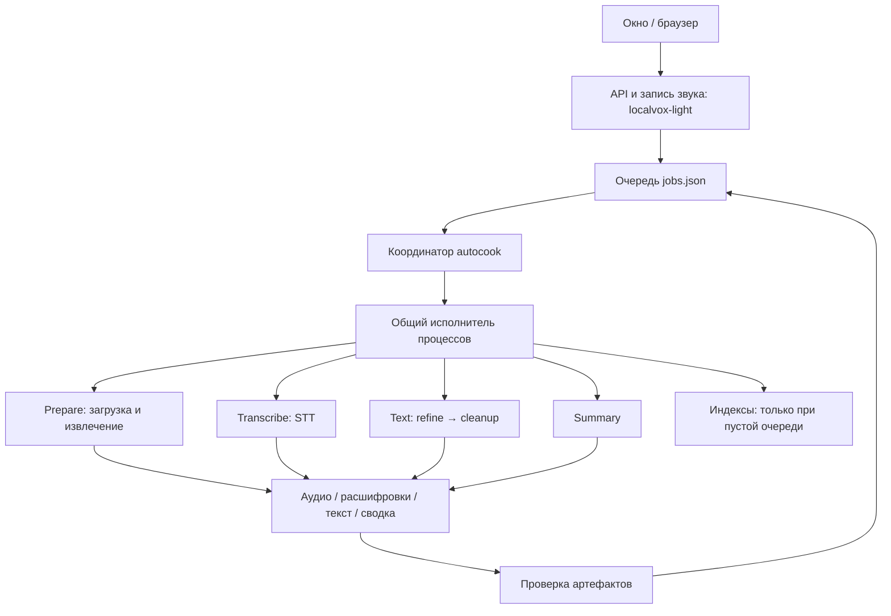

# Архитектура исполнения LocalVox

Черновое описание по коду: [пайплайн PIPE](../openspec/specs/processing-pipeline/spec.md). Проверки и известные
расхождения: [приёмка](../openspec/evidence/pipeline.md), [бэклог](../openspec/backlog.md).

Актуальное решение на ветке `new_course`, 27 сентября 2026. Детали фаз и статусов — в
[описании PIPE](../openspec/specs/processing-pipeline/spec.md); разбор медленного видео и логи — в
[processing-pipeline.md](processing-pipeline.md).

## Решение

Одно приложение в поставке, один координатор очереди, ограниченное число изолированных
обработчиков. Обработчик — обычный дочерний процесс с явно заданным владельцем,
протоколом, фазой, сроком исполнения и проверяемым результатом. `subprocess` сам по себе
не является проблемой; проблема — процесс без этих правил.



Все рабочие роли запускает `localvox-process`; отдельный бинарник для каждого этапа
не нужен. Сейчас поставляются основной процесс и этот обработчик. ONNX остаётся
зависимостью обработчика; запись и API не должны загружать модель ради сводки.
Один установщик/ярлык сохраняет удобство пользователя. Буквально один EXE тоже может
запускать себя в разных режимах, но здесь это смешало бы зависимости записи и ONNX,
не дав выигрыша в надёжности.

## На какие существующие решения опираемся

* [Electron utility processes](https://www.electronjs.org/docs/latest/tutorial/process-model):
  тяжёлая и потенциально аварийная работа отделена от главного процесса; её жизненным
  циклом управляет главный процесс. Переносим принцип владения, а не Electron.
* [Tauri sidecars](https://v2.tauri.app/develop/sidecar/): дополнительные исполняемые
  файлы можно включать в поставку одного desktop-приложения.
* [process-wrap](https://github.com/watchexec/process-wrap): готовые Windows Job Object
  и Unix process group вместо собственной реализации управления деревьями через FFI.
* [Temporal Activity Execution](https://docs.temporal.io/activity-execution): выполнение
  может повториться после сбоя, поэтому завершение и повтор должны иметь явный контракт.
  Используем этот принцип; сервер Temporal для локального приложения не добавляем.
* [SQLite для локальных приложений](https://www.sqlite.org/whentouse.html) подходит для
  транзакционной очереди. Сейчас миграция не исправила бы владение процессами, зависание
  pipe и ложное завершение. Оставляем одного писателя `jobs.json` с атомарной публикацией.
  Если появятся несколько координаторов или история сделает полное чтение очереди дорогим,
  SQLite станет естественной заменой хранилища очереди. Сами медиа останутся файлами.

## Границы в коде

| Компонент | Единственная основная ответственность |
|---|---|
| `localvox-light/src/main.rs` | Запуск приложения, запись, API и интерфейс |
| `localvox-light/src/autocook.rs` | Конфигурация исполнения, выдача фаз, ограничение параллелизма, принятие результата |
| `localvox-light-process` | Запуск, владение деревом ОС, таймаут, отмена, ограниченная диагностика |
| `localvox-light-asr/src/bin/localvox-process.rs` | CLI и диспетчер операций обработчика |
| `localvox-light-asr/src/prepare.rs` | Заполнение существующей сессии аудио из ссылки |
| `core/jobs.rs` | Состояние очереди, переходы фаз, ограниченные повторы |
| `core/artifacts.rs`, `processing.rs` | Проверка и подтверждение сохранённых результатов |
| `core/progress.rs`, `workflow.rs` | События операций и представление состояния для UI |
| `llm/claude_cli.rs` | Параметры и формат ответа Claude; исполнение делегируется общему модулю |

## Правила исполнения

1. При запуске координатор получает снимок окружения, пути, провайдера и лимиты.
   До захвата заданий выполняет `--worker-protocol`; несовместимая пара бинарников
   даёт явную ошибку preflight и не меняет очередь. После изменения настроек нужен
   перезапуск координатора.
2. Один владелец на сессию: `.worker.lock` удерживается от захвата фазы до приёмки
   результата. Ручной CLI и API повторной обработки используют тот же замок.
   Отсутствие heartbeat не позволяет перехватить живую работу и удалить её файлы.
3. `--worker-phase prepare|transcribe|text|summary` выполняет ровно указанную фазу.
   Выход с кодом 0 ещё не означает `Done`: координатор проверяет артефакт и лишь
   затем сохраняет переход очереди. Текст stderr объясняет ошибку, но не управляет переходом.
4. Для новых загрузок сначала атомарно пишется `prepare.json` с `complete: false`.
   После сохранения всего декодированного аудио записываются число сэмплов и SHA-256
   файлов, затем `complete: true`. Падение после первого чанка не подтверждает весь ролик.
   Приёмка и повтор проверяют контрольные суммы. UI проверяет манифест, заголовки и размеры,
   чтобы каждый опрос не перечитывал гигабайты аудио. Старые архивы без этой квитанции
   сохраняют прежнюю структурную проверку; это не доказательство исторической полноты.
5. На остановку приложения, таймаут и ошибку исполнения останавливается дерево процесса.
   На Windows Job Object с kill-on-close защищает также от аварийной смерти координатора.
   Обычный выход обработчика тоже убирает оставшихся потомков. Unix process group покрывает
   управляемую остановку; гарантия очистки при `SIGKILL` самого координатора здесь не заявлена.
6. Stdin/stdout/stderr используют временные файлы: нет взаимной блокировки pipe и потоков,
   бесконечно ждущих EOF от потомка. Вывод в памяти ограничен 8 MiB на поток; рост файлов
   проверяется каждые 100 мс. Это наблюдаемый порог остановки, а не дисковая квота.
   Результат и диагностика передаются в журнал после завершения; текущая работа видна
   по `progress.jsonl` и heartbeat координатора каждые 15 секунд.
7. Индексация тоже исполняется в контролируемом процессе. Запускается после освобождения
   очереди, отменяется при появлении задания, имеет отдельный таймаут. Ошибка индекса
   не откатывает расшифровку и не переводит готовую запись в незавершённую.

## Лимиты

Это предельное время попытки, а не прогноз продолжительности. Большой лимит допускает
длинные записи; диагностика внутри этапа показывает, где фактически потрачено время.

| Переменная | По умолчанию |
|---|---:|
| `LOCALVOX_PREPARE_TIMEOUT_SEC` | 1800 |
| `LOCALVOX_TRANSCRIBE_TIMEOUT_SEC` | 7200 |
| `LOCALVOX_TEXT_TIMEOUT_SEC` | 7200 |
| `LOCALVOX_SUMMARY_TIMEOUT_SEC` | 1800 |
| `LOCALVOX_INDEX_TIMEOUT_SEC` | 300 |
| `LOCALVOX_CLAUDE_TIMEOUT_SEC` — один запрос внутри сводки | 300 |

В логе фазы есть `job_id`, `session`, `phase`, `attempt`, PID, прошедшее время,
лимит, последняя операция и причина остановки. В `progress.jsonl` остаются операции
и фактические счётчики. В файлах результатов остаётся сама выполненная работа.

## Проверки и дальнейшие границы

```powershell
cargo test -p localvox-light-process
cargo test -p localvox-light-core -p localvox-light-api -p localvox-light-llm --lib
cargo test -p localvox-light --bin localvox-light
cargo build -p localvox-light -p localvox-light-asr --bin localvox-light --bin localvox-process
python scripts/check-pipeline.py
```

Процессные тесты используют настоящие процессы: заполнение stdout до чтения большого
stdin, отмена, таймаут, оставшийся потомок после успешного выхода родителя, лимит вывода,
ошибка запуска и аварийная смерть владельца Windows Job Object. Проверки очереди/артефактов
покрывают отсутствие результата, повреждение, частичную загрузку и отказ от повторного
стирания при живом владельце. Smoke-проверка использует временный архив и локальную
подставную LLM: протокол, изоляция текстовой фазы, heartbeat, повтор без генерации.

Это рефакторинг контура фоновой обработки, а не объявление всей кодовой базы законченной.
Следующие самостоятельные задачи: разделить большой CLI по операциям без изменения
протокола; декодировать длинное аудио потоком вместо накопления PCM в памяти; унифицировать
ручной импорт и фоновый Prepare; распространить владение сессией на остальные изменяющие
операции API. Отдельные постоянные STT-сервисы оправданы после измерения стоимости
повторной загрузки модели — сейчас они добавили бы состояние и восстановление соединений.

Параллелизм убирает простой разных записей, но не обещает ускорения одного LLM-запроса.
Реальную пропускную способность нужно измерять на release-сборке с выбранными моделями.
