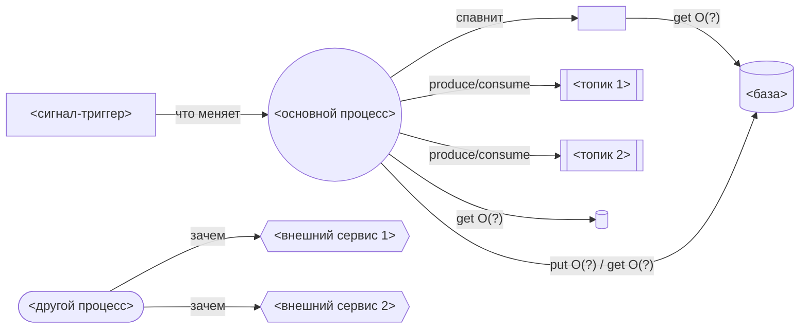

# Промпт: звездообразная схема сервиса (упрощённая версия для слабых моделей)

Короткий промпт для слабых моделей. Полная версия — в `docs/diagram-prompt.md`.

---

Построй схему сервиса из этого репозитория в виде **Mermaid `flowchart LR`** и
сохрани в файл `docs/service-architecture.md`.

Схема — **плоская звезда**:
- В центре ОДИН узел — основной запускаемый процесс.
- Вокруг — отдельные узлы, каждый соединён прямой стрелкой с центром.
- Один узел = одна реальная названная вещь из репозитория (имя файла, топика,
  бинарника, сервиса). НЕ делай узлы-категории вроде «Базы» или «Очереди».
- НЕ используй `subgraph`. НЕ добавляй shutdown/SIGTERM.

Добавь в схему такие узлы (если есть в коде), каждый отдельно:
1. **Основной процесс** — в центре, форма `(( ))`.
2. **Другие процессы** (CLI, воркеры) — форма `([ ])`, и нарисуй, куда они ходят.
3. **Сигнал-триггер** (НЕ выключение, а что-то, что меняет/пересчитывает логику)
   — форма `[ ]`, стрелка в то, на что влияет.
4. **Внутренний worker** (поток/таймер/фоновая задача) — форма `[ ]`, стрелка к
   тому, что он читает или пишет.
5. **База и KV** — форма `[( )]`. На стрелках напиши `get`/`put` и объём данных
   через Big-O: `O(1)`, `O(n)`, `O(n²)`.
6. **Топики очереди/брокера** — форма `[[ ]]`, КАЖДЫЙ топик отдельным узлом. На
   стрелках напиши `produce` или `consume`.
7. **Внешние сервисы** — форма `{{ }}`, на стрелке напиши, зачем туда ходят.

Шаблон (замени `<...>` на реальные имена из репозитория):

После схемы напиши:
- **Таблицу узлов**: узел → файл в коде → что делает.
- **Паттерны**: если заметил механизм (кэш, cleaner старых данных, WAL,
  повторная доставка, пул воркеров, hot-reload и т.п.) — одна строка на паттерн с
  указанием, к какому узлу он относится.

Перед ответом проверь: один центр, нет категорий, нет `subgraph`, у стрелок к
базе есть `get/put` + Big-O, у стрелок к топикам есть `produce/consume`.
