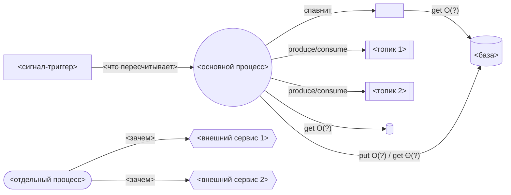

# Промпт: звездообразная схема сервиса (полная версия)

Промпт для построения плоской звездообразной схемы запускаемого из репозитория
сервиса. Рассчитан на сильные модели. Упрощённый вариант — в
`docs/diagram-prompt-lite.md`.

---

**Задача:** построй схему запускаемого из этого репозитория сервиса и сохрани её в отдельный файл `docs/service-architecture.md`. Формат диаграммы — **Mermaid `flowchart LR`**.

**Топология — строго плоская звезда (один уровень лучей):**
- В центре — **ровно один** узел: основной запускаемый процесс сервиса.
- Все остальные узлы — прямые «лучи» от центра. **Глубина графа от центра = 1** (кроме отдельных процессов, см. ниже).
- Расстояние/порядок узлов ≈ сила связи с центром: сильнее связан — ближе.

**Правило узлов:** один узел = одна **конкретная названная** сущность из репозитория (реальное имя файла/топика/очереди/бинарника/сервиса). НЕ создавай узлы-категории.

**Anti-rules (запрещено):**
- запрещены узлы-обёртки/группы/категории/хабы (например «Процессы», «Сигналы», «Очереди», «Хранилища») и любые промежуточные уровни между центром и сущностью;
- запрещён `subgraph` для группировки по типам;
- запрещён shutdown/SIGTERM-обработчик как компонент.

**Обязательная таксономия узлов (форма Mermaid → смысл):**
- `(( ))` — центр (основной процесс);
- `([ ])` — отдельный запускаемый процесс (CLI/воркер/демон); рисуй его сбоку как самостоятельный узел и показывай, **куда он ходит** (в те же базы/очереди/внешние сервисы);
- `[( )]` — база данных или KV;
- `[[ ]]` — топик/очередь брокера (каждый топик — **отдельный** узел: топик 1, топик 2, …);
- `{{ }}` — внешний сервис;
- `[ ]` — узел-триггер сигнала и узел внутреннего worker.

**Обязательные компоненты (каждый — отдельным узлом, если есть в репо):**
1. основной процесс (центр) и отдельные процессы (CLI/воркеры) как самостоятельные узлы;
2. узел-**триггер сигнала/внешнего проявления**, влияющего на бизнес-логику (НЕ shutdown), со стрелкой в затронутый компонент и подписью, что пересчитывается/реконфигурируется;
3. узел **внутреннего worker** (поток/горутина/background task), срабатывающего по таймеру или сигналу, со стрелкой к тому, что он читает/пишет;
4. **база/KV** — отдельными узлами; на стрелках подпиши логические `get/put` и объём данных в Big-O (`O(1)`/`O(n)`/`O(n log n)`/`O(n²)`, от чего зависит);
5. **брокер/очередь** — по узлу на каждый топик/очередь; на стрелках `produce`/`consume`;
6. **внешние сервисы** — отдельными узлами, со стрелкой «куда и зачем».

**После диаграммы добавь два блока текста:**
- **Таблица узлов:** узел → что это в коде (с путём к файлу) → характер обращения/объём.
- **Распознанные механизмы и паттерны:** для каждого явного или неявного паттерна (saga, cleaner старых данных, cache, idempotent/dedup consumer, WAL, backpressure, competing consumers, hot-reload/epoch, at-least-once + recovery, ticker/polling и т.п.) — отдельная строка с **явным указанием на компонент**, к которому он относится, и ссылкой на код.

**Скелет (соблюдай структуру, подставь реальные узлы):**

**Чек-лист самопроверки перед выдачей (исправь, если нарушено):**
- [ ] центр ровно один; нет узлов-категорий/хабов; нет `subgraph`-группировок;
- [ ] каждый узел — конкретная названная сущность репозитория;
- [ ] каждый топик/очередь и каждый внешний сервис — отдельный узел;
- [ ] на рёбрах к базе/KV есть `get/put` + Big-O; на рёбрах к топикам — `produce/consume`;
- [ ] отдельные процессы (CLI/воркеры) нарисованы и показано, куда они ходят;
- [ ] есть таблица узлов и блок «распознанные паттерны» со ссылками на компоненты.
