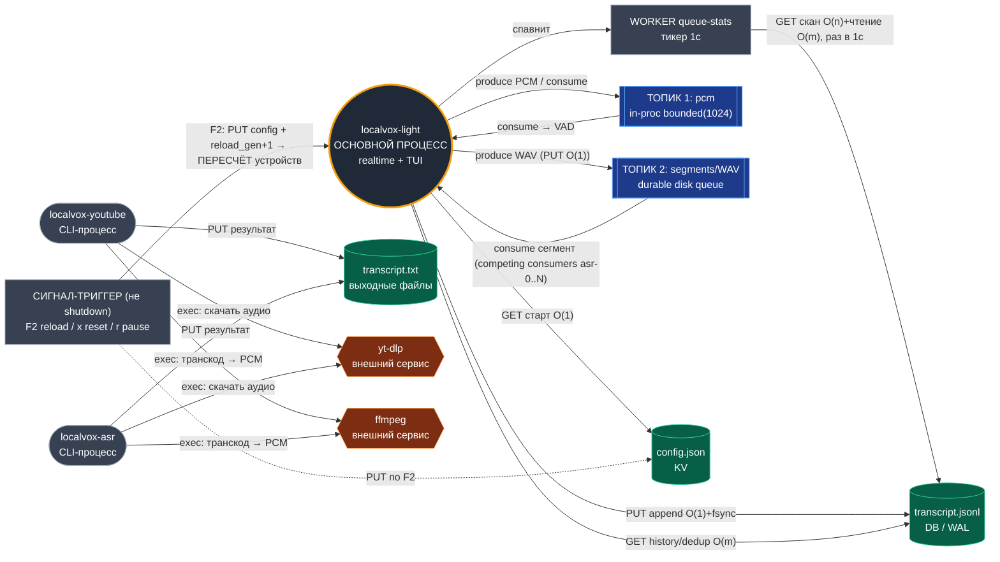

# Схема сервиса `localvox-light` (звездообразная топология)

Плоская звезда: в центре — основной процесс `localvox-light`. Вокруг — конкретные
ресурсы и соседи (база, KV, топики очереди, внешние сервисы, триггеры, worker).
Отдельные CLI-процессы (`localvox-youtube`, `localvox-asr`) нарисованы как
самостоятельные процессы рядом и показано, куда они ходят. Расстояние до центра
≈ сила связи: топики и хранилище — близко, внешние сервисы — дальше.

## Узлы звезды

| Узел | Что это в коде | Обращение / объём |
|------|----------------|-------------------|
| **Центр — `localvox-light`** | `engine::run_engine`, оркестрирует потоки mic/loopback/pipeline/asr-pool/TUI | — |
| **СИГНАЛ-ТРИГГЕР** | `F2` → сохранить устройства + `reload_gen.fetch_add(1)`; `x` → reset транскрипта; `r` → pause записи (`tui.rs:357,414,418`) | пересчёт устройства захвата без рестарта |
| **WORKER queue-stats** | поток-тикер раз в 1с (`engine.rs:51-64`) | `GET` скан каталога **O(n)** + чтение журнала **O(m)** |
| **ТОПИК 1 — pcm** | `crossbeam bounded(1024)`, produce mic+loopback → consume pipeline (`engine.rs:95`) | produce/consume, backpressure |
| **ТОПИК 2 — segments/WAV** | `seg`-канал + WAV на диске как очередь (`engine.rs:96`, `session.rs:94`) | produce/consume, durable, at-least-once |
| **DB — `transcript.jsonl`** | append-only журнал с fsync (`transcript.rs:50-92`) | `PUT` **O(1)**+fsync; `GET` всего файла **O(m)**; рост **O(n)** |
| **KV — `config.json`** | устройства mic/loopback (`light_config.rs`) | `GET` старт **O(1)**; `PUT` по F2 |
| **CLI `localvox-youtube`** | отдельный процесс: URL/файл → транскрипт (`youtube/src/main.rs`) | ходит в yt-dlp, ffmpeg; `PUT` transcript.txt |
| **CLI `localvox-asr`** | отдельный процесс: URL/файл → ONNX GigaAM (`asr/src/main.rs`) | ходит в yt-dlp, ffmpeg; `PUT` transcript.txt |
| **Внешний сервис `yt-dlp`** | `std::process` exec для скачивания | вызов CLI-процессами |
| **Внешний сервис `ffmpeg`** | `std::process` exec, транскод → PCM s16le 16kHz | вызов CLI-процессами |

## Распознанные механизмы и паттерны

- **WAL / durable append-only log** → компонент **DB `transcript.jsonl`**. Каждая строка — самодостаточный JSON, запись с `flush`+`fsync` (на unix), устойчиво к частичной записи (`transcript.rs:50-60`).
- **At-least-once delivery + crash recovery (redelivery)** → компонент **ТОПИК 2 (WAV-очередь)**. Необработанные WAV переотправляются на старте через `recover_unprocessed` (`session.rs:94-135`).
- **Idempotent / dedup consumer** → пара **ТОПИК 2 ↔ DB**. Множество `processed_seg_ids` (seg_id из журнала) не даёт обработать сегмент повторно — эффект, близкий к exactly-once (`transcript.rs:79-92`).
- **Cleaner старых/битых данных** → компонент **ТОПИК 2**. `remove_orphan_part_files` чистит незавершённые `.part` при старте; обработанный WAV удаляется после `PUT` в журнал (`session.rs:11-25`, `engine.rs:545`).
- **Backpressure** → компонент **ТОПИК 1 (pcm)**. Ограниченный `bounded(1024)` тормозит захват, если pipeline не успевает (`engine.rs:95`).
- **Competing consumers / worker pool** → компонент **ТОПИК 2 → asr-0..N**. N воркеров тянут из одного канала сегментов (`engine.rs:441-470`).
- **Hot-reload через generation counter (epoch)** → пара **СИГНАЛ → Центр**. `reload_gen: AtomicU64`: потоки захвата сравнивают поколение и переоткрывают устройство без рестарта (`engine.rs:267,312`).
- **Ticker / polling worker** → компонент **WORKER queue-stats**. Периодический опрос каталога вместо событийных уведомлений (`engine.rs:51-64`).
- **VAD-сегментация + noise gate** → внутри **Центра** перед записью в ТОПИК 2 (`pipeline.rs`, `engine.rs:607`).
- **Shared-core, multi-binary** → **CLI-процессы** переиспользуют `localvox-light-core` (Vosk/ONNX, ingest), общий код, разные точки входа и внешние сервисы.
