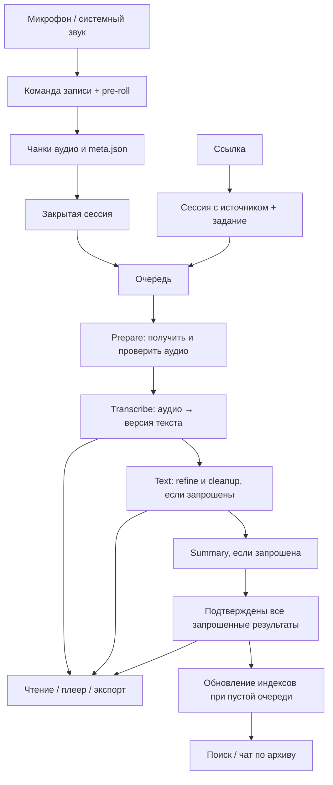

# Processing pipeline Specification

## Purpose

Контракт полного пути записи/ссылки к аудио, версиям текста и сводке.
Связь: F1/F3/F4/F6/F8/F10/F11; PIPE-001–014.

Статус контракта: **accepted**, 2026-09-27. Это обязательное поведение,
а не заявление о безошибочности текущей сборки.
[Основание принятия и границы](../../baseline.md) ·
[Сверка каждого требования](../../evidence/coverage.md#processing-pipeline).

## Результат для пользователя

Пользователь добавляет источник или завершает запись. В архиве остаются исходное
аудио, расшифровка с таймкодами и, если запрошено, исправленная версия, читаемый текст
и сводка. Пока идёт работа, видны очередь, операция и прошедшее время. После сбоя
пользователь сохраняет уже выполненную работу и получает понятную причину остановки.

Этот контракт описывает обычную фоновую обработку с включёнными чанками сессий.
Ручной CLI и старые архивы имеют оговорки ниже. Live-распознавание голосовой команды
не является подтверждением готовности полной расшифровки записи.

Стрелки показывают зависимости, а не обязательную генерацию на каждом запуске:
валидный сохранённый результат позволяет пройти фазу без модели; незапрошенные
ветки пропускаются. Индексация не входит в условие `Done` задания записи.

## Requirements

### Requirement: PIPE-001 Приём источника и постановка

Код: [from_url](../../../crates/localvox-light-core/src/ingest.rs), [ChunkLane](../../../crates/localvox-light-core/src/pipeline.rs).

Система SHALL принимать HTTP(S)-ссылку как сессию с источником и сохранённым ingest-заданием; обнаруживать закрытые записи отдельно. Успех приёма регулируется INV-INGEST-001.

**Ссылка.** Принимается очищенный HTTP(S)-адрес. Сразу создаётся каталог сессии,
`meta.json` с источником и задание `kind=ingest`, `phase=prepare`. Фоновый импорт
ссылки сейчас запрашивает refine, cleanup и summary. Название может появиться позднее,
но сама ссылка не должна исчезать до окончания скачивания.

**Запись.** Захват микрофона/системного звука и pre-roll живут в движке. Команда
начала открывает запись на диск; запись получает чанки и метаданные. После закрытия
её обнаруживает координатор и ставит `kind=cook`. Активная запись и незакрытый
`.part` не должны попасть в обычный фоновый STT. Параметры постобработки берутся
из настроек. Аудио имеет приоритет над вычисляемыми производными.

**BL-001 исправлен в исходниках:** ошибки metadata/queue возвращаются вызывающему;
каталоги одновременных ссылок резервируются отдельно. Создание каталога и запись
очереди не являются одной транзакцией; повтор URL не является дедупликацией.
См. [проверку](../../evidence/implementation-review-2026-09-27.md).

#### Scenario: Ссылка при доступном хранилище

- **WHEN** добавлен допустимый URL
- **THEN** созданы meta с источником и Pending ingest; наличие текста ещё не требуется.

### Requirement: PIPE-002 Захват работы и восстановление

Код: [start_phase, reclaim_abandoned](../../../crates/localvox-light-core/src/jobs.rs), [coordinate](../../../crates/localvox-light/src/autocook.rs).

Система SHALL проверять worker-протокол, захватывать сессию и восстанавливать незавершённую фазу после рестарта.

Координатор проверяет протокол `localvox-worker/1` до захвата заданий. Настройки
исполнения и окружение дочерних процессов фиксируются при старте. Несовместимый
обработчик не должен превращать ожидающие задания в успешно выполненные.

Перед выполнением берётся `.worker.lock` сессии, затем сохраняется переход
`Pending → Running`. Блокировка удерживается до проверки результата. Очередь меняется
одним координатором/API в процессе под общим mutex; многопроцессные независимые
писатели `jobs.json` этой реализацией не поддерживаются.

При старте координатора оставшиеся `Running` возвращаются в `Pending` с той же
фазой; завершённые артефакты проверяются и переиспользуются. Сбрасывается `force`,
чтобы восстановление не повторяло разрушительный пользовательский запрос.
Обычное чтение очереди не должно перезапускать задания. Битый `jobs.json` не заменяется
пустой очередью: работа блокируется с диагностикой.

#### Scenario: Рестарт на сводке

- **WHEN** координатор на старте обнаружил Running Summary
- **THEN** задание возвращено в Pending Summary, force снят; ранее сохранённые результаты проверяются для повторного использования.

### Requirement: PIPE-003 Prepare — получение полного аудио

Код: [ingest_into_session](../../../crates/localvox-light-asr/src/prepare.rs), [commit_preparation](../../../crates/localvox-light-core/src/artifacts.rs).

Система SHALL подтверждать импорт аудио только после commit полного декодированного потока.

Для записи со звуком проверяются её зарегистрированные чанки. Для новой ссылки
обработчик проверяет инструменты, пытается получить название, скачивает дорожку
через yt-dlp и декодирует её ffmpeg в mono PCM16 16 kHz; результат сохраняется чанками.
Получение названия ограничено отдельно и не является обязательным для расшифровки.

Перед новой загрузкой атомарно публикуется `prepare.json` с `complete=false`.
После сохранения **всех** декодированных сэмплов проверяются чанки, число сэмплов,
источник и контрольные суммы; публикуется `complete=true`. Только после этого
подготовка завершена. Один целый WAV после падения посреди ролика не доказывает,
что сохранён весь ролик. Повтор такой подготовки не должен удваивать список чанков.

Это доказательство сохранения всего декодированного потока, а не независимая
проверка полноты ролика на удалённом сайте. Приёмка/повтор фазы проверяют SHA-256;
частые опросы UI проверяют манифест, заголовки и размеры. Старое аудио без квитанции
проверяется структурно; историческую полноту таким способом доказать нельзя.

#### Scenario: Обрыв посреди импорта

- **WHEN** complete=false и сохранился лишь один из чанков
- **THEN** Prepare не принимается как полный результат.

### Requirement: PIPE-004 Transcribe — аудио в версию текста

Код: [cook_session_asr](../../../crates/localvox-light-core/src/cook.rs), [commit_processing](../../../crates/localvox-light-asr/src/bin/localvox-process.rs).

Система SHALL сохранять версию STT и проверяемое подтверждение, включая пустой результат.

STT читает аудио сессии, делит речь на допустимые окна, распознаёт и, при включённой
диаризации, назначает говорящих. Новая версия записывается в
`transcripts/vNNN-*.jsonl` и регистрируется в `versions.json`; сохраняются таймкоды,
модель и параметры. `best` определяет рабочую версию для следующих операций.
Исправление текста не должно переписывать исходную STT-версию.

Сначала сохраняется результат, затем его подтверждение в `processing.json`.
Код выхода обработчика сам по себе не подтверждает расшифровку. Если речи нет,
нужен проверяемый пустой результат с причиной; отсутствие файла не означает «тишина».
Подтверждённый пустой транскрипт не должен бесконечно повторяться ради текста/сводки.

Уточнение: переименование говорящего меняет speaker во всех версиях; неизменность относится к исходному тексту распознавания, не ко всем байтам JSONL.

#### Scenario: Пустой транскрипт

- **WHEN** STT сохранил допустимый пустой результат и подтверждение причины
- **THEN** это отличается от пропавшего файла и не вызывает бесконечный повтор ради появления речи.

### Requirement: PIPE-005 Text/refine — исправление распознавания

Код: [refine_session](../../../crates/localvox-light-llm/src/pipeline.rs).

Система SHALL создавать refined-версию с родителем и сохранять временную структуру реплик.

Refine читает подтверждённый транскрипт, исправляет текст пакетами через выбранную
LLM и сохраняет новую версию с родителем; таймкоды и связь с исходной речью сохраняются.
Результат становится рабочей версией. Если подходящая версия уже подтверждена,
повтор использует её. Если нечего исправлять, фиксируется это обстоятельство.
Ошибка refine останавливает зависимую обработку этой попытки.

#### Scenario: Повтор refine

- **WHEN** подходящая refined-версия уже подтверждена и force не запрошен
- **THEN** сохраняется результат без обязательного нового вызова модели.

### Requirement: PIPE-006 Text/cleanup — читаемый текст

Код: [cleanup_by_lines](../../../crates/localvox-light-llm/src/pipeline.rs), [save](../../../crates/localvox-light-core/src/readable.rs).

Система SHALL хранить cleanup как изменения строк рабочей версии в processed.json.

Cleanup использует рабочую версию после refine либо STT, если refine не запрошен.
Фразы обрабатываются с привязкой к номерам строк. Основной результат — `processed.json`:
версия-источник и исправления конкретных строк. Необоснованная замена фразы должна
сохранять исходную формулировку, а не незаметно выдумывать содержание.

Это отдельный этап от refine: у него собственные события, время и артефакт.
Cleanup не создаёт ещё одну STT-версию и не удаляет исходный текст. Сохранённый
результат проверяется на соответствие версии и допустимым строкам.

#### Scenario: Неверные строки cleanup

- **WHEN** processed.json ссылается на другую версию или недопустимые строки
- **THEN** проверка артефакта отказывает.

### Requirement: PIPE-007 Summary — сводка и её проверка

Код: [process_session, chat_grounded](../../../crates/localvox-light-llm/src/pipeline.rs).

Система SHALL строить сводку по частям с объединением при необходимости и сохранять сомнения отдельно от целостности файла.

Сводка строится из рабочей расшифровки с шаблоном и глоссарием. Для длинного текста
обрабатываются части; при нескольких частях результаты объединяются отдельным
запросом. Одна часть не требует дополнительного объединения. Время включает загрузку
необходимой модели проверки, генерацию, проверки, допустимые повторные запросы
и сохранение. Это не один непрозрачный вызов «сделать summary».

В операциях должны быть видны номер части, ожидание ответа, проверка и объединение.
Проверка исходных сущностей повторно используется внутри обработки документа.
Отсутствие модели NER означает ограниченную проверку имён, а не подтверждение их
достоверности; проверки чисел и прочие проверки имеют собственные ограничения.

Результат — `summary.md` и запись о его источнике/контрольной сумме.
`unverified` обозначает сомнение в содержании сохранённого результата; это не то же
самое, что повреждённый или отсутствующий файл. Пользователь может подтвердить
содержание. Сохранность артефакта и качество вывода — независимые свойства.

#### Scenario: Несколько частей

- **WHEN** текст разбит на несколько частей
- **THEN** после обработки частей выполняется объединение; для одной части отдельного reduce нет.

### Requirement: PIPE-008 Принятие результата и переход

Код: [finish_phase, verify_phase](../../../crates/localvox-light-core/src/jobs.rs), [verify](../../../crates/localvox-light-core/src/artifacts.rs).

Система SHALL проверять артефакты перед сохранением следующей фазы очереди.

После завершения обработчика координатор заново проверяет требуемые результаты
через `verify_phase`, затем сохраняет переход очереди. При ошибке подтверждения или
сохранения перехода фаза не считается завершённой. Вывод stdout/stderr служит
диагностикой, а не протоколом подтверждения результата.

| Сущность | Состояния | Что означает |
|---|---|---|
| Задание | `Pending`, `Running`, `Failed`, `Done` | Расписание и итог запрошенной работы |
| Фаза | `prepare`, `transcribe`, `text`, `summary` | Следующая незавершённая часть задания |
| Артефакт | `ready`, `empty`, `missing`, `invalid`, `failed` | Проверенный результат или причина его отсутствия |
| Этап UI | `waiting`, `queued`, `blocked`, `running`, `done`, `skipped`, `failed`, `invalid` | Представление зависимостей, событий и результатов |

У задания одна фаза за раз. После Prepare идёт Transcribe, затем нужные Text/Summary.
После последней запрошенной фазы — `Done`. Отключённые операции не изображаются
выполненными. Если файл исчез/изменился после `Done`, статус артефакта должен показать
расхождение; сохранённое состояние задания не доказывает актуальную целостность.
Обнаруженные повреждения SHALL восстанавливаться по PIPE-010; реализация этого правила для старых Done ещё неполна — BL-004.

#### Scenario: Exit 0 без результата

- **WHEN** обработчик завершился успешно, но требуемого подтверждённого артефакта нет
- **THEN** очередь не переходит в следующую фазу как после успеха.

### Requirement: PIPE-009 Параллелизм и владение ресурсами

Код: [coordinate](../../../crates/localvox-light/src/autocook.rs), [pending_for, start_phase](../../../crates/localvox-light-core/src/jobs.rs).

Система SHALL перекрывать независимые фазы разных сессий в ограниченных линиях.

Разные записи могут находиться в разных фазах одновременно: скачивание B,
распознавание A и обработка текста предыдущей записи. На каждую линию — один
обработчик: Prepare, STT, локальный текст. Локальная сводка использует линию текста;
Claude имеет отдельную линию. Внутри одной сессии зависимости сохраняются.

Это параллелизм сессий. Параллельный STT по окнам одной записи и постоянный сервис
с загруженной моделью не входят в текущую реализацию. Настройка более широкого пула
требует измерений памяти и пропускной способности (BL-003/BL-008).

#### Scenario: Разные сессии

- **WHEN** A ждёт STT, B готова к Text, C — к Prepare и линии свободны
- **THEN** фазы разных сессий могут выполняться одновременно; одна сессия не захватывается дважды.

### Requirement: PIPE-010 Ошибки, таймауты, отмена и повтор

Код: [run](../../../crates/localvox-light-process/src/lib.rs), [mark_failed](../../../crates/localvox-light-core/src/jobs.rs).

Система SHALL сохранять причину отказа, ограничивать попытки и управлять деревом дочерних процессов.

Ошибка сохраняет причину и не отменяет результаты предыдущих фаз. До трёх попыток
на фазу выполняются через цикл очереди. После исчерпания — `Failed`; автоматическое
возвращение возможно не более трёх раз с интервалами 1/2/4 часа. Ручной повтор даёт
новую попытку по правилам выбранной операции. Это не гарантия exactly-once: вызов
модели может повториться после сбоя до фиксации подтверждения.

На таймаут/остановку процессное дерево принадлежит общему исполнителю. На Windows
проверено закрытие Job Object при аварийной смерти владельца; для Unix заявлена
управляемая остановка группы, но не очистка после SIGKILL координатора.
Внешний сервер Ollama/облачный провайдер не является потомком приложения: прекращение
локального ожидания не доказывает отмену вычисления на сервере.

Остановка приложения оставляет незавершённое задание для восстановления. Явная отмена пользователем SHALL прекращать принадлежащую обработку, подтверждать освобождение владения и не возобновлять отменённую работу автоматически после рестарта; готовые независимые результаты сохраняются (DEC-007). Изменение
модели/шаблона само по себе не разрешает повторно обработать весь готовый архив.
Лимиты и детали stdio перечислены в [архитектуре](../../../docs/architecture.md).

#### Scenario: Таймаут

- **WHEN** контролируемая worker-фаза превысила свой лимит
- **THEN** исполнитель прекращает принадлежащее ему дерево и фиксирует отказ; внешний Ollama не является этим деревом.

#### Scenario: Отмена обработки

- **WHEN** пользователь отменяет активное задание
- **THEN** отмена подтверждается после остановки/освобождения; незавершённое не выдаётся за Done и не оживает автоматически после рестарта, валидный текст сохраняется.

#### Scenario: Повреждение после Done

- **WHEN** обнаружен повреждённый готовый артефакт при доступном необходимом источнике
- **THEN** автоматический ограниченный ремонт пересоздаёт только повреждённое и зависимые результаты, сохраняя независимые валидные артефакты (DEC-003); исчерпание попыток видно пользователю.

#### Scenario: Нет источника для ремонта

- **WHEN** повреждённый результат нельзя пересоздать из оставшихся данных
- **THEN** виден отказ с указанием отсутствующего источника; бесконечного повтора и фиктивного успеха нет.

### Requirement: PIPE-011 Честные время и наблюдаемость

Код: [timing, view](../../../crates/localvox-light-core/src/workflow.rs), [activity, fold](../../../crates/localvox-light-core/src/progress.rs), [Progress](../../../ui/src/Progress.tsx).

Система SHALL разделять ожидание, обработку и длительность материала, показывая активность длительных операций.

В UI различаются ожидание очереди, календарное время после старта и общее время.
Время после старта включает паузы между фазами/повторы; это не время CPU.
Длительность видео не участвует в расчёте этих интервалов. Неизвестная граница —
`null`/«неизвестно», а не выдуманный ноль. Новый ручной запуск имеет собственную границу.

Heartbeat блокирующей операции обновляет активность, сохраняя её начальное время.
Каждые пять секунд он сообщает о жизни обработчика/ожидании; счётчик выполненных
частей меняется только по факту. Координатор каждые 15 секунд пишет фазу, попытку,
PID, прошедшее время, лимит и последнюю операцию. Heartbeat не обещает продвижение LLM.

Источник UI — проверенные результаты + очередь + события. Нельзя красить предыдущий
этап готовым лишь потому, что последующий начал работать. Недоступный API/битая очередь
не должны выглядеть как пустая очередь или успешное завершение.

#### Scenario: Нет времени старта

- **WHEN** задание только ожидает в очереди
- **THEN** UI не показывает выдуманные ноль секунд обработки; длительность видео не используется как elapsed.

### Requirement: PIPE-012 Повторная обработка и сохранение первичных данных

Код: [recook, ensure_recookable](../../../crates/localvox-light-api/src/archive.rs).

Система SHALL различать повтор сводки, текста и полного STT и проверять владение сессией при recook.

Повтор сводки, читаемого текста и полного STT — разные команды. Повтор производной
использует существующий транскрипт. Полный повтор создаёт новую STT-версию. Аудио не
удаляется вследствие ошибки LLM. API сначала должен принять задание, затем инвалидировать
только выбранные производные; живой владелец `.worker.lock` запрещает этот повтор.

Ограничения: единый lease покрывает recook/best/lang/имена/delete, но controlled
cancel/delete занятого job и общая crash-транзакция ещё не реализованы (BL-002).
Text/Summary после удаления аудио работают по строго проверенному транскрипту;
All требует пригодного аудио. BL-007 реализован и проверен; основной контракт —
[VER-004](../transcript-versions/spec.md).

#### Scenario: Занятая сессия

- **WHEN** worker держит .worker.lock и API получает recook
- **THEN** повтор отклоняется до удаления производных.

### Requirement: PIPE-013 Индексы, чтение и срок хранения

Код: [warm_indexes](../../../crates/localvox-light/src/autocook.rs), [sweep_audio_retention](../../../crates/localvox-light-core/src/chunks.rs).

Система SHALL читать сохранённые тексты независимо от фонового индексатора и удалять аудио отдельно по retention.

Готовые артефакты доступны для чтения/экспорта независимо от индекса. Поиск и плеер
опираются на выбранную best-версию и её таймкоды; аудио может быть недоступно после
retention, но это не должно стирать сохранённый текст/сводку. По умолчанию retention
отключён; opt-in очистка требует проверенного STT и свободной сессии по
[STORE-003](../audio-storage/spec.md).

Индексы — производные данные. Фоновое обновление запускается при пустой очереди
в управляемом процессе, ограничено по времени и прерывается при появлении работы.
Ошибка индексации не переводит готовую расшифровку в Failed. Полнота выдачи поиска
и API-запросы индексации требуют отдельного контракта F4, а не выводятся из этого правила.

#### Scenario: Аудио после retention

- **WHEN** политика удалила аудиофайлы, сохранив текст
- **THEN** текст остаётся доступен; проигрывание утраченного аудио недоступно.

### Requirement: PIPE-014 Другие входы и совместимость

Код: [main](../../../crates/localvox-light-asr/src/bin/localvox-process.rs).

Система SHALL различать обычный CLI и внутренний запуск отдельной worker-фазы.

`localvox-process --ingest <url|file>` импортирует материал напрямую в CLI; путь
пока отличается от фонового Prepare (BL-006). Обычный CLI может последовательно
выполнить несколько операций. `--post-only` работает над сохранённым транскриптом
без STT; `--status` читает состояние без моделей и мутации архива.

`--worker-phase` — внутренний контракт координатора: ровно одна фаза. Его гарантии
внешнего надзора действуют при запуске координатором, а не от одного наличия флага.
Старые подтверждения без SHA-256 допускают структурную проверку и помечаются как
таковые; чтение статуса не должно незаметно «доподписывать» старые данные.

#### Scenario: Диагностика CLI

- **WHEN** вызван --status
- **THEN** модели не загружаются и состояние архива не изменяется.

### Requirement: INV-INGEST-001 Durable ingest acknowledgement

Система SHALL возвращать успешный приём URL только после успешного сохранения источника и читаемого задания очереди. Ошибка сохранения meta или очереди SHALL доходить до вызывающего, не выглядеть успешным приёмом. Создание каталога и запись очереди не являются одной транзакцией; исходник при отказе очереди сохраняется для диагностики/повтора.

Код: [from_url](../../../crates/localvox-light-core/src/ingest.rs), [enqueue_new](../../../crates/localvox-light-core/src/jobs.rs).
Проверено на временных каталогах: [evidence BL-001](../../evidence/implementation-review-2026-09-27.md).

#### Scenario: Queue write failure

- **WHEN** создание каталога/источника прошло, а запись задания не удалась
- **THEN** API возвращает ошибку и объясняет отсутствие принятого задания; повтор не уничтожает исходные данные.

#### Scenario: Metadata write failure

- **WHEN** источник не удалось сохранить в meta.json
- **THEN** операция не сообщает об успешном приёме.

#### Scenario: Successful acknowledgement

- **WHEN** API вернул успешный приём
- **THEN** на диске читаются источник и соответствующее задание, доступные после рестарта.

## Карта кода

| Ответственность | Файл и входные точки |
|---|---|
| Приём ссылки | [ingest.rs](../../../crates/localvox-light-core/src/ingest.rs): `from_url` |
| Захват и сессия | [engine.rs](../../../crates/localvox-light-core/src/engine.rs): `run_engine`; [chunks.rs](../../../crates/localvox-light-core/src/chunks.rs): `ChunkRecorder`, `recover_orphan_chunks` |
| Очередь и переход | [jobs.rs](../../../crates/localvox-light-core/src/jobs.rs): `start_phase`, `finish_phase`, `verify_phase`, `reclaim_abandoned` |
| Координатор | [autocook.rs](../../../crates/localvox-light/src/autocook.rs): `coordinate`, `run_phase`, `accept_phase`, `warm_indexes` |
| Исполнение ОС | [process/lib.rs](../../../crates/localvox-light-process/src/lib.rs): `run` |
| Диспетчер CLI | [localvox-process.rs](../../../crates/localvox-light-asr/src/bin/localvox-process.rs): `main`, `commit_processing` |
| Получение аудио | [prepare.rs](../../../crates/localvox-light-asr/src/prepare.rs): `ingest_into_session` |
| STT | [cook.rs](../../../crates/localvox-light-core/src/cook.rs): `cook_session_asr` |
| Текст и сводка | [llm/pipeline.rs](../../../crates/localvox-light-llm/src/pipeline.rs): `refine_session`, `process_session`, `chat_grounded` |
| Подтверждения | [artifacts.rs](../../../crates/localvox-light-core/src/artifacts.rs): `capture`, `verify`, `commit_preparation`; [processing.rs](../../../crates/localvox-light-core/src/processing.rs): `record`, `inspect` |
| Состояние и время | [progress.rs](../../../crates/localvox-light-core/src/progress.rs): `activity`, `fold`; [workflow.rs](../../../crates/localvox-light-core/src/workflow.rs): `view`, `timing` |
| Отображение и команды | [archive.rs](../../../crates/localvox-light-api/src/archive.rs), [Progress.tsx](../../../ui/src/Progress.tsx), [Queue.tsx](../../../ui/src/Queue.tsx) |

## Implementation status

PIPE-010: автоматический ремонт Done (BL-004) и пользовательская отмена (BL-002) ещё не реализованы. Производительность пачки (BL-003), полный ручной импорт (BL-006) и живая индексация (BL-005) не проверены. Частичная готовность, фазовые receipts и mock heartbeat проверены.

[Матрица по требованиям](../../evidence/coverage.md#processing-pipeline) ·
[Расхождения RV](../../review.md) ·
[Выполненные проверки](../../evidence/implementation-review-2026-09-27.md).
Ниже сохранены дополнительные наблюдения о реализации, не исключения из требований.

## Observed limitations

BL-001/007 реализованы и проверены в исходниках; BL-002 выполнен частично.
BL-003/004/005/006/008 остаются открытыми. См. [бэклог](../../backlog.md)
и [очередь сверки](../../review.md). Это описание рабочего дерева, не свидетельство
производительности установленной сборки и не утверждение, что все отказы диска обработаны.
